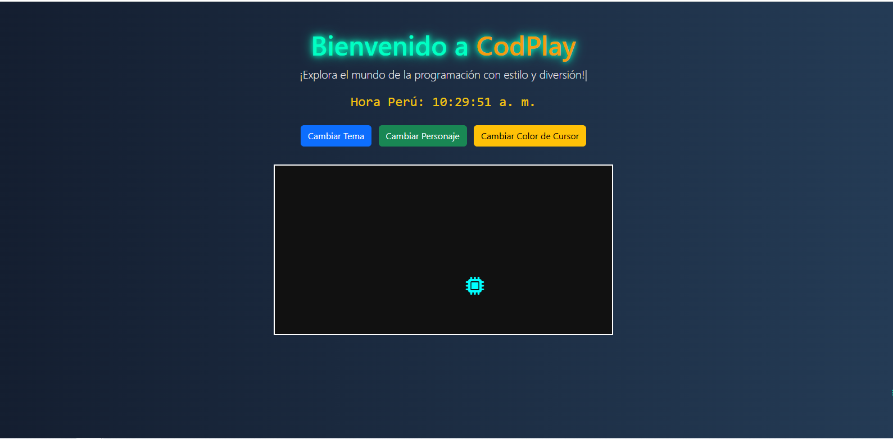

# codePlay

## 🧠 Descripción

**CodePlay** es una landing page interactiva inspirada en el universo de la programación, pensada para ofrecer una experiencia visual atractiva y dinámica, más allá de un simple portafolio.

Diseñada con una combinación de **HTML, CSS, JavaScript, PHP y Bootstrap**, esta página ofrece una interfaz profesional con elementos animados, efectos personalizados y funcionalidades interactivas que buscan captar la atención del visitante desde el primer momento.

---

## ✨ Características

- 🎨 **Diseño moderno y oscuro** con transiciones suaves
- 🕹️ **Personajes animados** que corren y saltan en pantalla
- 🖱️ **Cursor personalizado** con cambio dinámico de color
- ⏰ **Hora en tiempo real** de Perú (zona horaria automática)
- 🌓 **Modo claro/oscuro** seleccionable por el usuario
- 🔁 **Cambio de personajes** representados con íconos tecnológicos
- 🧩 **Código modular** usando PHP para separar lógica y datos
